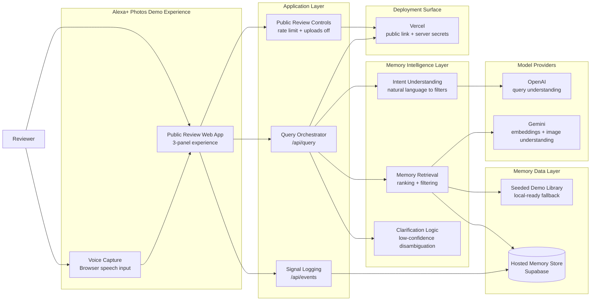
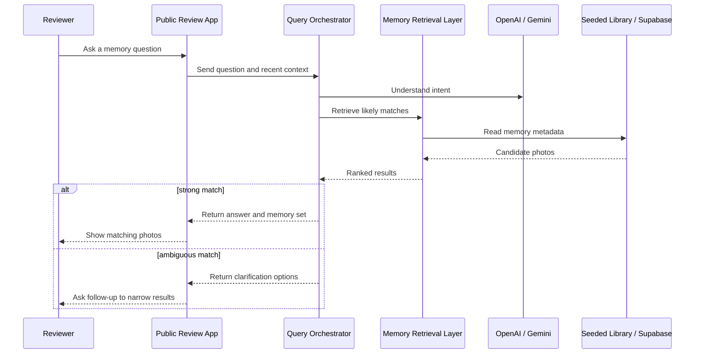

# Talk to Your Memories

## Clean architecture diagram

## Reviewer flow

## Short framing for Amazon-style explanation

Use this wording:

> The experience is built as a thin review client on top of a server-side orchestration layer. The client captures multimodal input and displays results, while the server interprets the request, retrieves the most relevant memories, and safely manages model access and product signals. This lets us validate the core conversational recall loop with a public review link, without exposing credentials or requiring account setup.
