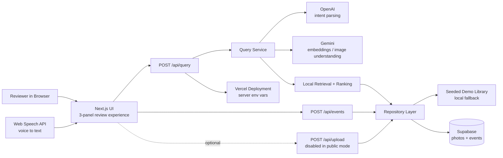
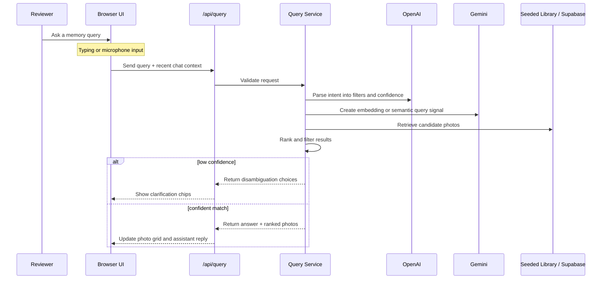
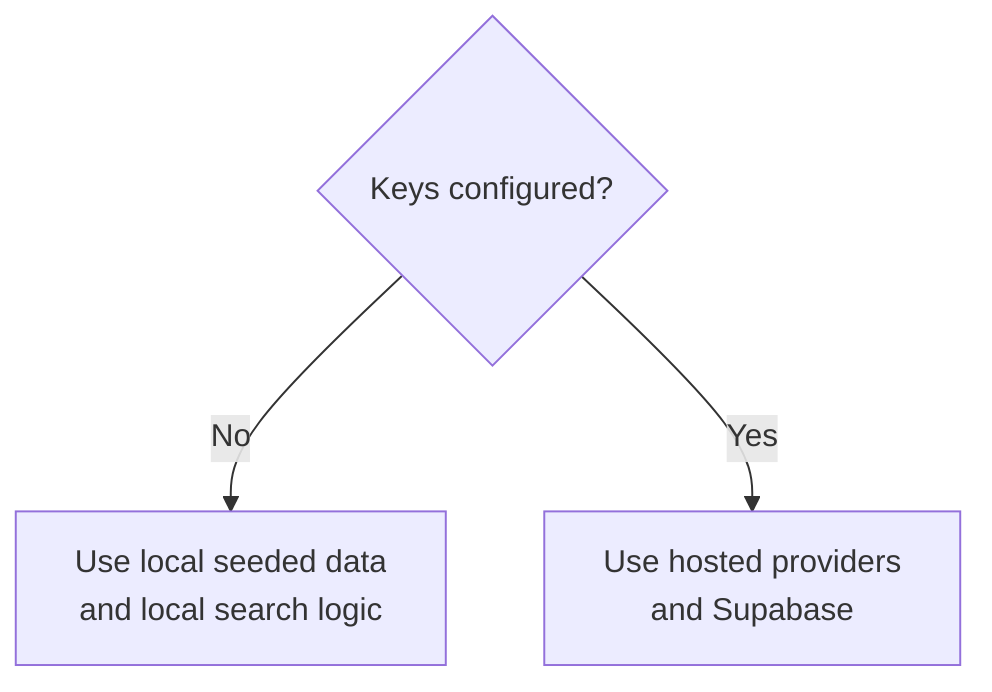

# Talk to Your Memories Architecture

## High-level architecture

## Runtime explanation

## Local fallback mode

## Component map

- `Browser UI`
  - Built with `Next.js + React`
  - Shows library summary, chat, and results grid
- `Web Speech API`
  - Lets the reviewer speak instead of type
  - Converts voice into text in the browser
- `/api/query`
  - Safe server-side endpoint for search requests
  - Prevents model keys from being exposed to the browser
- `Query Service`
  - Central orchestration layer
  - Combines intent parsing, retrieval, ranking, and fallback behavior
- `Repository Layer`
  - Hides whether data comes from local seeded content or Supabase
- `Seeded Demo Library`
  - Makes the app usable immediately with no setup
- `Supabase`
  - Intended hosted store for photo metadata and event logs
- `OpenAI`
  - Intended LLM layer for turning natural language into structured search intent
- `Gemini`
  - Intended multimodal layer for embeddings and image understanding
- `Vercel`
  - Intended public hosting surface with server-side secret management

## Interview-friendly summary

You can describe the architecture like this:

> The browser is intentionally thin. It handles interaction, display, and voice capture, but all intelligence runs behind server routes. The server interprets the query, retrieves matching memories from either seeded local data or Supabase, and returns ranked results. That lets the demo work locally with no keys, while preserving a production-shaped architecture for public deployment.
